# Git and GitHub Tutorial (Week 1)

This week you'll become familiar with Git and GitHub. Git allows you to version text-based files, and share changes with your collaborators. Before you start the tutorial, you will need to have Git and GitHub properly setup. If not, please follow the getting started guide on Canvas. We'll walk you through the basic process of cloning a repository, committing changes, pushing to a remote, and issuing pull requests.

## Branching and Committing

As a first step, you should become comfortable with thinking in terms of Git trees. There are numerous Git simulators on the internet that allow you to practice your skills.

Navigate to [this Git simulator](https://git-school.github.io/visualizing-git/#free) and re-create the branching structure below, using the `git commit`, `git branch <branch>` and `git checkout <branch>` commands. As a notational convention, expressions that should be substituted by your own input are indicated by angle brackets `<...>`. You can restart the simulation using the `clear` command. Make a screenshot of your tree including the commands you used to obtain your tree, and save the screenshot for later.  

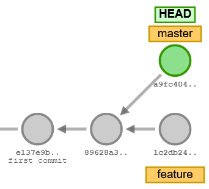

## Commit Messages

Upon a commit, you have the option to specify a short message (`git commit -m "<message>"`, notice the quotes). A commit message should be short and to-the-point. Active phrasing is preferred, e.g. "fix bug in feature selection" instead of "fixed bug in feature selection". This way, the logs (`git log`) will read like a recipe that describes the development of your application. Usually if you find yourself writing a commit message that involves "and", e.g. "fix bug in feature selection and add regression test", this indicates that this commit should have been two separate commits, i.e. "fix bug in feature selection" and "add regression test for feature selection".

## Cloning a Project

Accept the assignment invitation from GitHub Classroom. This creates a new personal remote repository with the skeleton code for the GitTutorial project. In your browser, navigate to the newly created project GitHub page. Each repository as hosted by GitHub has a unique remote address. You can find the remote address under the green `Code` button:

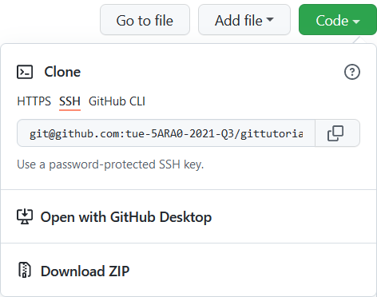

This address can be used to clone the repository to your local machine. On your machine, open VSCode and start a terminal. In the terminal, navigate to the folder in which you wish to download the root folder for the project. Type `git clone git@github.com:tue-5ARA0-2021-Q3/gittutorial-<YOUR GITHUB HANDLE>.git GitTutorial`, where you insert your own GitHub handle. This command creates a new `GitTutorial` folder on your machine downloads the repository contents:

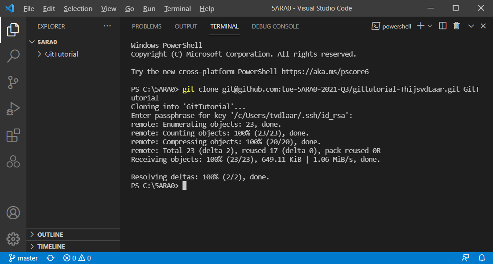

## Ignoring Files

In the VSCode terminal, navigate to the project folder, `cd GitTutorial`. In the `GitTutorial` folder you'll find a `.gitignore` file. This file specifies any files or folders that should not be tracked by Git.

First and foremost, files that contain any secret keys or tokens relating to your project should be included in the `.gitignore` _before_ any commits are made. Committing keys or tokens to Git leaves you vulnerable to serious security exploits. For example, an attacker might use your secret token to gain access to your database, or contract hosted services in your name.

Secondly, binary files are often included in the `.gitignore`. Small changes in your code base may lead to big changes in binary files (for example, your compiled executables). Because Git tracks any text-based changes, you'll want to include any (frequently changing) binaries in the `.gitignore`. 

***
### Assignment 1.1
Add a line to the `.gitignore` that excludes all files that starts with `token`. The `.gitignore` syntax is specified in the [documentation](https://git-scm.com/docs/gitignore). Start tracking your changes by typing `git add .gitignore`. Verify that the `.gitignore` file is tracked by typing `git status`. Commit (`git commit -m "<message>"`, where you substitute your own message) and push your changes to GitHub (`git push origin master`).
***

## A Basic Git Workflow

Before starting work on any new functionality, it is good practice to first split off a branch from the `master`. Let's start writing some (mockup) documentation for the present `GitTutorial` project.

***
### Assignment 1.2
Start a new `docs` branch, and switch your `HEAD` to this branch. Start a new `documentation.md` file and make some (arbitrary) textual edits. The `git status` command should now show that you have untracked changes in the `documentation.md` file:

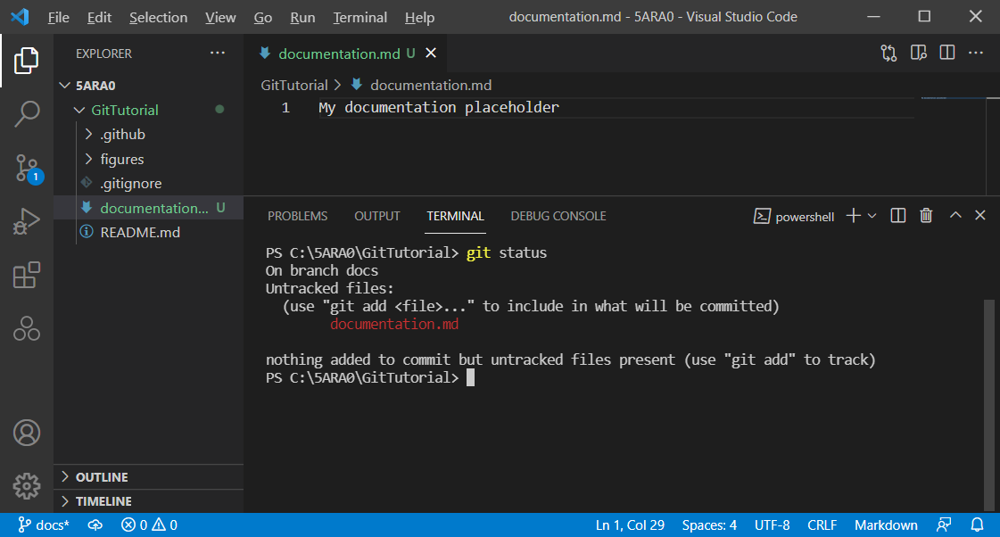

Start tracking your changes with the `git add --all` command, which tracks all files (except those excluded by `.gitignore`). Again typing `git status` shows that the changes in `documentation.md` are now tracked. Commit your changes and push them to a new remote branch by `git push origin docs:docs`.
***

In the above push command, `origin` refers to the remote address for the project. The `docs:docs` specifies that we wish to push the local `docs` branch (before the `:`) to the remote `docs` branch (after the `:`):

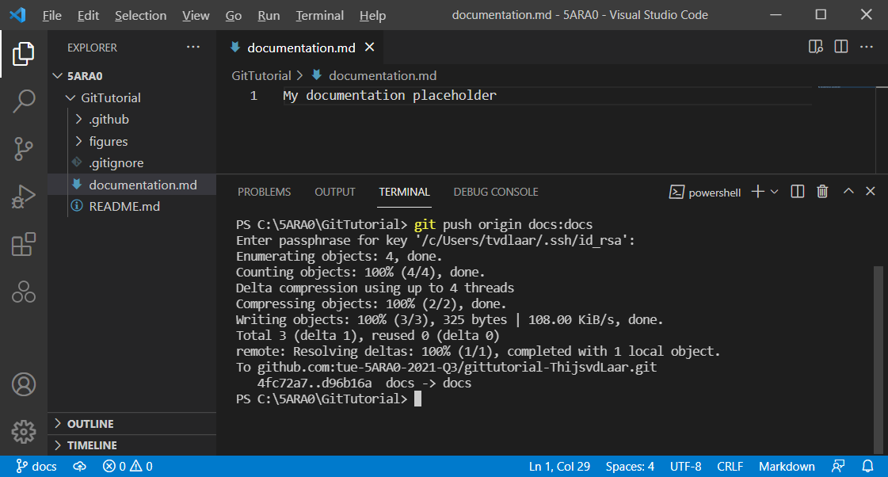

## Merging Changes through a Pull Request

The remote `docs` branch (with your included changes) is now also available to any of your collaborators. On the GitHub page, you should now see the `docs` branch in the branching menu:

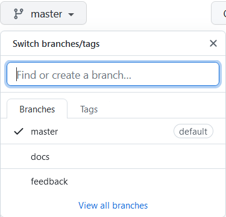

Once you're satisfied with your work, you may wish to merge your changes in the `master` branch. We could do this locally as shown in the lecture demo. However, this time we will merge our changes through a pull request on GitHub. With a pull request, you issue a request to your collaborators to merge your work (the `docs` branch). You can then discuss your contribution with the others online, and they may request changes if required.

***
### Assignment 1.3
Open the page for the `docs` branch and press the green "Compare & pull request button". A dialog will open where you can further detail your contribution and start a discussion thread:

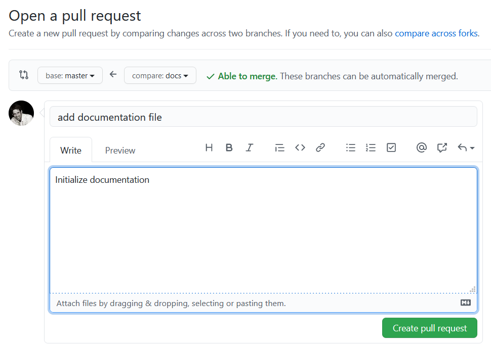

After the pull request is created (and any discussion has converged), the `docs` branch can be merged by clicking on "Merge pull request", and confirming:

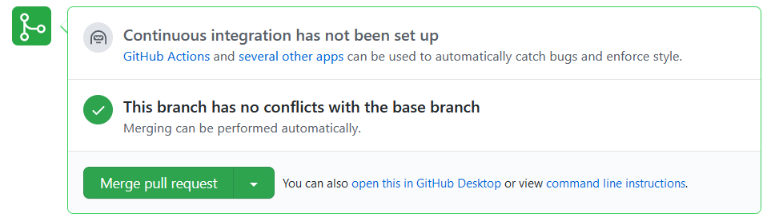

Create and merge the pull request.
***

Then, in your local terminal, switch to the `master` branch (`git checkout master`), and pull the changes from GitHub (`git pull origin master`):

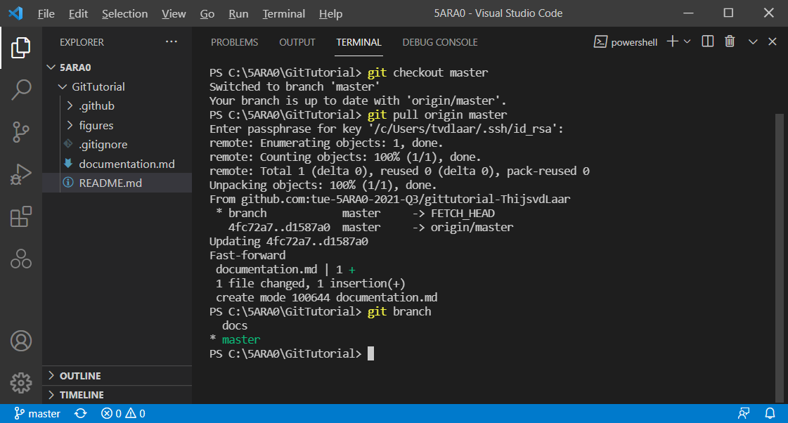

The changes are now merged in `master`. Remove the `docs` branch by typing `git branch -d docs`:

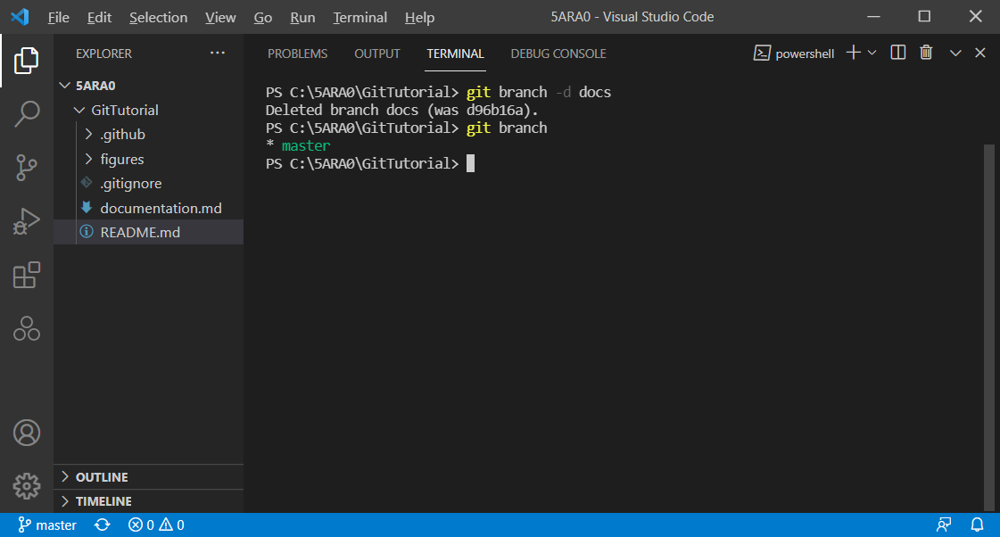

Note that the `docs` branch is deleted locally, but that it is still open on the remote (GitHub). As long as your collaborators are still contributing to the branch, it is a good idea to leave it open on the remote. You can leave the remote branch open for now.

## GitHub Issues

On the GitHub project page you also have the option to open issues. GitHub issues are an important feature when communicating between remote teams. If your project is public, any GitHub user can submit issues to report bugs and feature requests.

***
### Assignment 1.4
Navigate to the GitHub issues page of your project and start a new issue by clicking the corresponding green button:

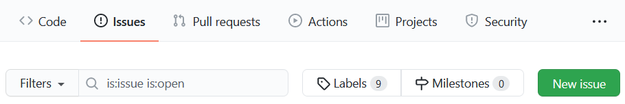

Submit an issue that includes the screenshot you made under Assignment 1.1.
***

## Git for Software Development

***
### Assignment 1.5
Open a feature branch and, in `sieve.py`, write a `sieve` method that implements the [Sieve of Eratosthenes](https://en.wikipedia.org/wiki/Sieve_of_Eratosthenes#Pseudocode). The `sieve` method should return the highest prime number under a given limit. You can run the function from a VSCode terminal with `py -3 -m sieve`.

Once you're done, merge your work into the `master` branch (either via a pull request or locally on your machine). Don't forget to push your changes to GitHub.
***
